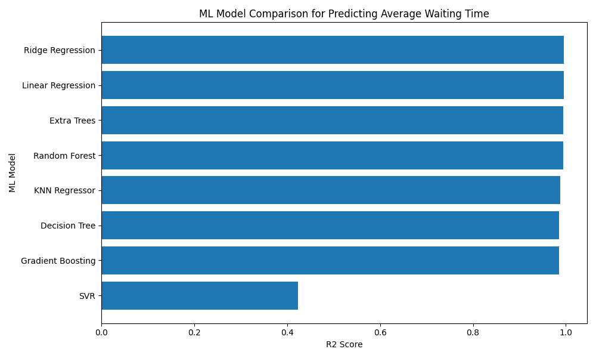

# Data Generation using Modelling and Simulation for Machine Learning

## Assignment

This project demonstrates how simulation can be used to generate synthetic data for a machine learning problem.

The selected simulation package is **SimPy**, a process-based discrete-event simulation library in Python.

## Objective

The objective of this project is to simulate a customer service queue and generate data using different input parameters. The generated simulation dataset is then used to train and compare multiple machine learning models.

The ML task is to predict the **average waiting time** of customers in the queue.

## Simulation Tool Used

**SimPy**

SimPy is used for discrete-event simulation. It allows us to model real-world systems such as queues, service counters, manufacturing lines, hospitals, call centers, and logistics systems.

## System Simulated

A customer service queue was simulated.

Customers arrive at a service system based on an arrival rate. They wait for an available server and then receive service based on a service rate.

## Input Parameters

The following parameters were randomly generated for each simulation:

| Parameter | Description |
|---|---|
| arrival_rate | Rate at which customers arrive |
| service_rate | Rate at which customers are served |
| num_servers | Number of available servers |
| simulation_time | Total time for which the simulation runs |
| utilization | Estimated utilization of the system |

## Output Parameters

The simulator recorded the following outputs:

| Output | Description |
|---|---|
| customers_served | Total number of customers served |
| max_wait_time | Maximum waiting time observed |
| avg_wait_time | Average customer waiting time |

## Dataset Generation

A total of **1000 simulations** were generated.

For each simulation, random values of input parameters were passed to the simulator and the output values were recorded.

The generated dataset is saved as:

`simulation_dataset.csv`

## Machine Learning Task

The target variable for prediction is:

`avg_wait_time`

The input features used are:

- arrival_rate
- service_rate
- num_servers
- simulation_time
- utilization
- customers_served
- max_wait_time

## ML Models Compared

The following machine learning models were trained and compared:

1. Linear Regression
2. Ridge Regression
3. Decision Tree Regressor
4. Random Forest Regressor
5. Gradient Boosting Regressor
6. Extra Trees Regressor
7. KNN Regressor
8. Support Vector Regressor

## Evaluation Metrics

The models were compared using:

| Metric | Meaning |
|---|---|
| MAE | Mean Absolute Error |
| RMSE | Root Mean Squared Error |
| R2 Score | Goodness of fit |

Higher R2 score and lower error values indicate better performance.

## Results

The model comparison results are available in:

`model_comparison_results.csv`

## Result Graph

## Conclusion

The best model is the one with the highest R2 score and lowest prediction error.

In most runs, ensemble-based models such as Random Forest, Extra Trees, or Gradient Boosting perform better because they can capture non-linear relationships between queue parameters and waiting time.
